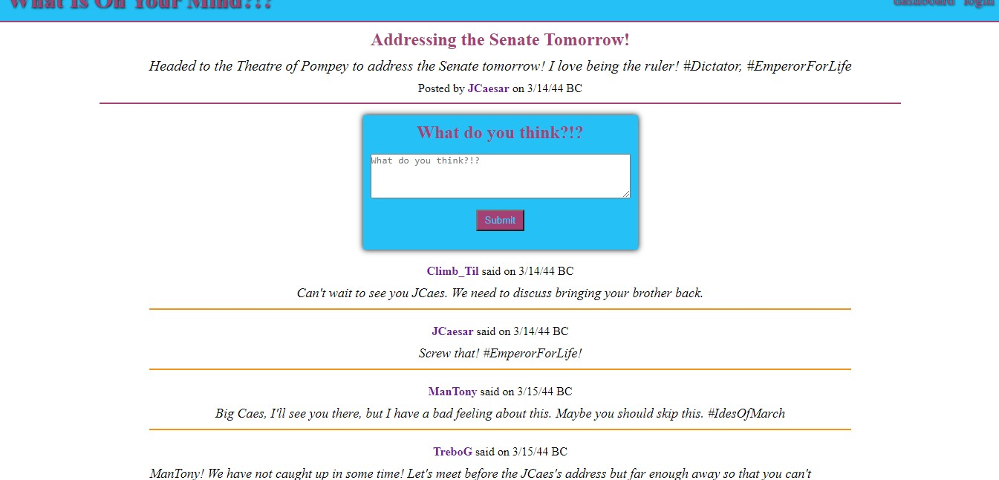

# Python Social(What Is On Your Mind?!?)

  

  

  ## Description
  This application is a retooling of an [earlier Node.js project](https://github.com/cabralwilliams/what-is-on-your-mind) to use Python on the back end.
  As with the prior application, this application is a fully funtional blog site.  (Admittedly, though, I have failed to actually test all of its features yet.)  It allows a user to create an account, and then once that account is created and the user logged on, the user can create his or her own blog posts and comment on blog posts created by other registered users.  In this updated iteration of the project, the user can also up-vote and down-vote posts.  (The user can also spam voting!)  The user is also able to delete prior posts once logged in.
  
  ## Link
  [Python Social](https://slithering-python-social-7.herokuapp.com/)
  
  ## Table of Contents
  
  * [Installation](#installation)
  * [Usage](#usage)
  * [License](#license)
  * [Contributing](#contributing)
  * [Tests](#tests)
  * [Questions](#questions)
  
  ## Installation
  
  This application utilizes python and the pymysql, flask, sqlalchemy, python-dotenv, bcrypt, and gurnicorn python packages.  If you wish to run a version of this locally, you will have to download the project files, create your own .env file, and adjust the files appropriately based on the database name, user, and password you wish to use.  (To avoid installing the python packages globally, you should enter a virtual environment by running the following two commands: `python -m venv venv` and `.\venv\Scripts\activate`.  You can run the install commands once in the venv and leave the venv by entering `deactivate` at any time.)  If you wish to use the deployed version, you can do so by navigating to the deployed link provided elsewhere in this file.  (If running the file locally, input the command `python -m flask run` from the command line in the root of the file structure.)
  
  ## Usage
  
  As stated in the installation instructions, if running this application locally, start the server with `python -m flask run` and then navigate to http://127.0.0.1:5000/ in a browser to start blogging away.  Otherwise, navigate to link to the deployed application provided elsewhere in this file.
  
  ## License
  
  The content of this project is licensed under the [MIT License](https://opensource.org/licenses/MIT).  Please click [here](https://opensource.org/licenses/MIT) for more information about how you may use code in this project.

  ## Contributing

  This project adheres to the [Contributor Covenant](https://www.contributor-covenant.org/).
  
  
  ## Tests
  
  There were no specific tests used during the creation of this project.
  
  ## Questions
  [GitHub Profile](http://github.com/cabralwilliams)
  
  For any questions concerning this application, please contact me at cabral.williams@gmail.com.